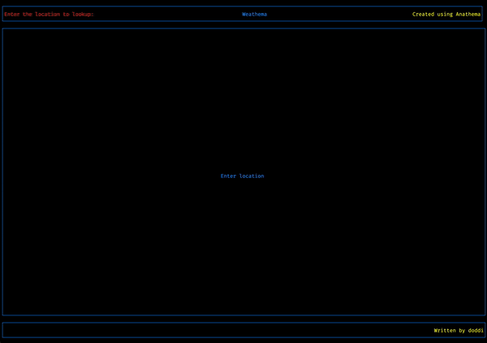

# Weathema
## Description
A simple weather app that displays the current weather of a city. This is a playground fortesting out the [Anathema TUI](https://togglebyte/anathema) library.

Use the tab key to cycle to the top left enter location widget (it will highlight in green whenit has focus). Enter the city name and press enter to fetch the weather data.

### Widgets
- Location widget: A simple text input widget that allows the user to enter the city name.
- Weather widget: A widget that displays the current weather of the city.
- Spinner widget: A simple spinner widget that spins when the app is fetching data (bottom left).
- Error widget: A widget that displays an error message when the app fails to fetch data.

## Usage
```bash
cargo run <city>
```

Ctrl-C to exit the app.



### Issues
- Point width on the temperature graph does not have an affect despite specifying it in the `Graph` aml.
- Aligning the min and max temperature values on the graph is a bit off. See graph_component.aml comments
- When any values are changed on the graph_component.aml file the datapoints are lost on the temperature graph